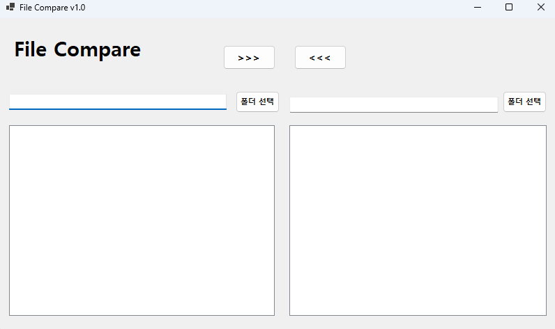
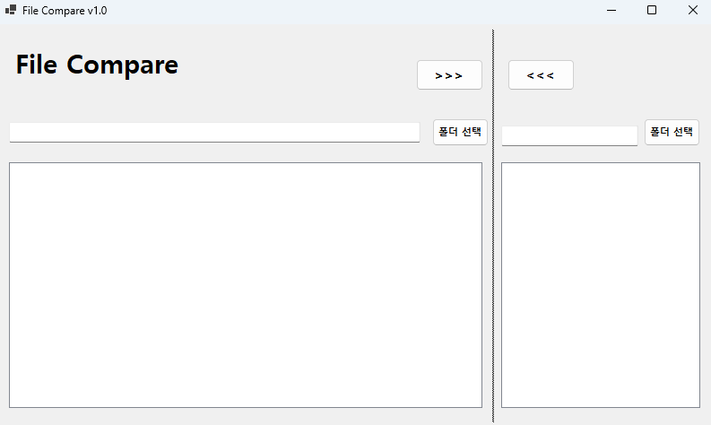
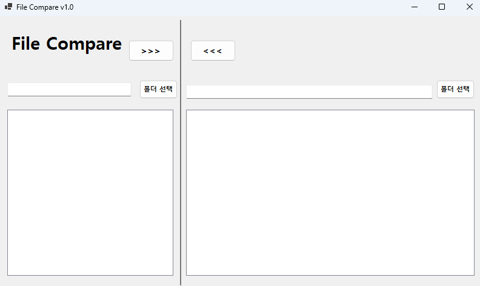
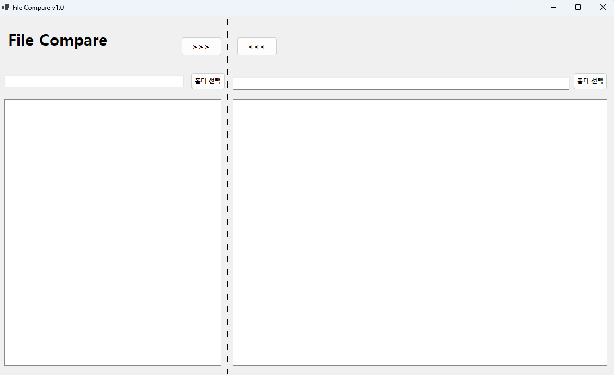
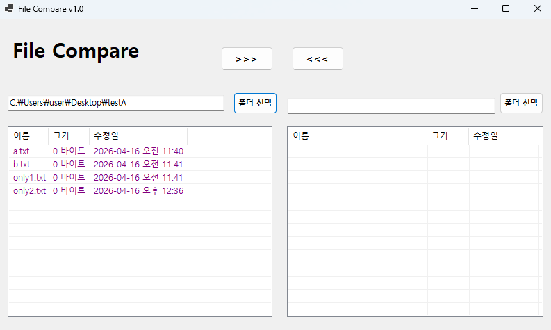

## 개요
- C# 프로그래밍 학습
- 1줄 소개: 메세지를 입력하고 이를 로그에 기록하는 메신저 프로그램
- 사용한 플랫폼:
  -C#, .NET Windows Forms, Visual Studio, GitHub
- 사용한 컨트롤:
  - Label, Button, Panel, SplitContainer, TextBox, ListView
- 사용한 기술과 구현한 기능:
  - Visual Studio를 이용하여 UI 구현
  - label.visible을 활용하여 로그인 실패 시 경고 메시지 표시
  - Focus를 활용하여 엔터키를 누를 시 자동으로 다음 스텝으로 넘어가도록 구현
  - Enter, Leave를 활용하여 TextBox에 입력 힌트 표시 및 제거 기능 구현
  - && 연산자를 활용하여 로그인 성공, 실패 확인 구현
  - UseSystemPasswordChar를 활용하여 password 입력 시 글자 숨기기 기능 구현

## 실행 화면 (과제1)
- 과제1 코드의 실행 스크린샷

- 과제 내용
  - UI 구성
  - 컨트롤에서기본적으로제공하는기능구동확인

- 구현 내용과 기능 설명
  - SplitContainer를 활용하여 영역을 나누어 구분 지을 수 있도록 구현
  - Anchor와 Dock 기능을 활용하여 영역을 옮겨도 따라가도록 구현
  - Panel을 이용하여 각 컨트롤 마다 영역을 구분하여 구현

## 실행 화면 (과제2)
- 과제2 코드의 실행 스크린샷

- 과제 내용
  - 폴더 선택 기능과 파일 리스트 기능 구현 (색상 구분 표시)
  - 양쪽 폴더의 파일 표시

- 구현 내용과 기능 설명
  - FolderBrowserDialog를 활용하여 컴퓨터의 폴더를 선택할 수 있도록 구현
  - dlg.SelectedPath를 활용하여 선택한 폴더의 경로를 가져오도록 구현